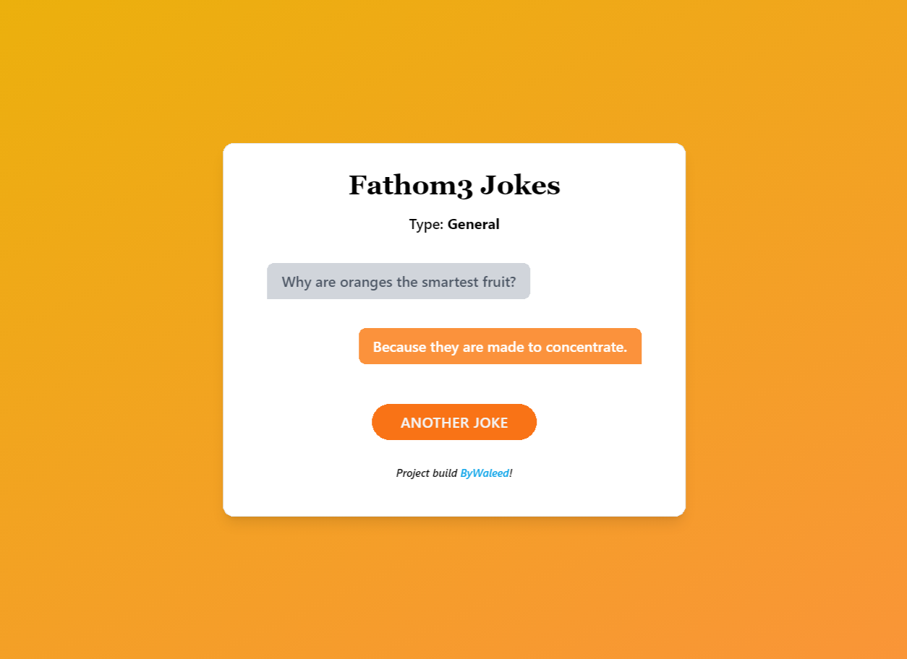

# Fathom3 Jokes

A very simple fullstack application written in Express (backend) and Vanilla JS (frontned).



## Description

Express Handlebars templating enginer is used for rending the home view.

Tailwind CSS is used for CSS (CDN).

Vanilla JS is used to fetch and show jokes from the ```/random``` endpoint.

SQLite database is used for storing jokes. The table is created using a migration and can be populated with default [Jokes API](https://github.com/15Dkatz/official_joke_api/blob/master/jokes/index.json) by hitting the ```/seed``` endpoint.


## Routes:

```/``` - Home View

```/random``` - Returns a random joke in JOSN object

```/seed``` - Fetches jokes from this [Jokes API](https://github.com/15Dkatz/official_joke_api/blob/master/jokes/index.json) and store them in SQLite database


## Installation

Clone reponsitory: ```git clone https://github.com/ByWaleed/Fathom3-Jokes.git```

Install packages: ```npm install```

Create database file in the project root: ```touch data.db```

Start server: ```npm start```

Visit [localhost:8000/seed](http://localhost:8000/seed) to seed database (redirected to home once done seeding)

## Licence

Project created ByWaleed under the [MIT](https://opensource.org/licenses/mit-license.html) Licence.
